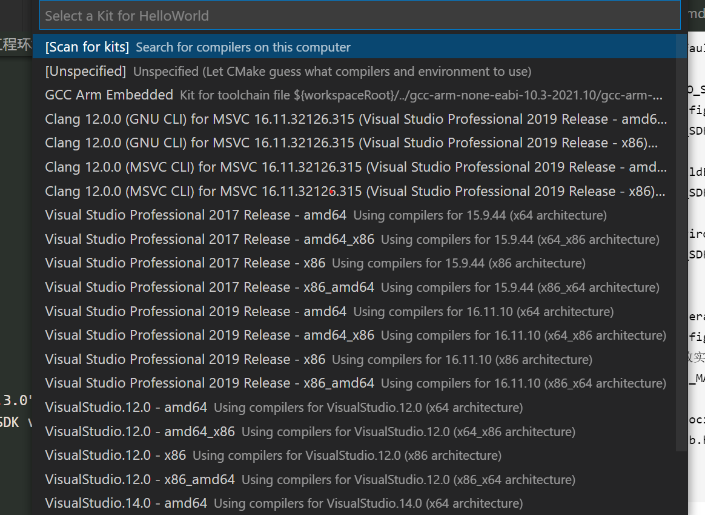
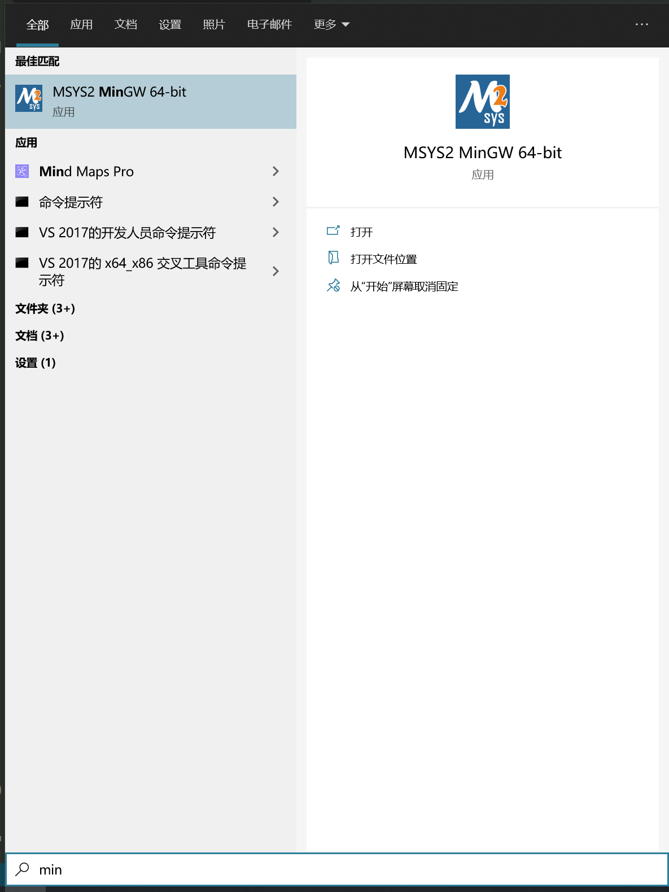
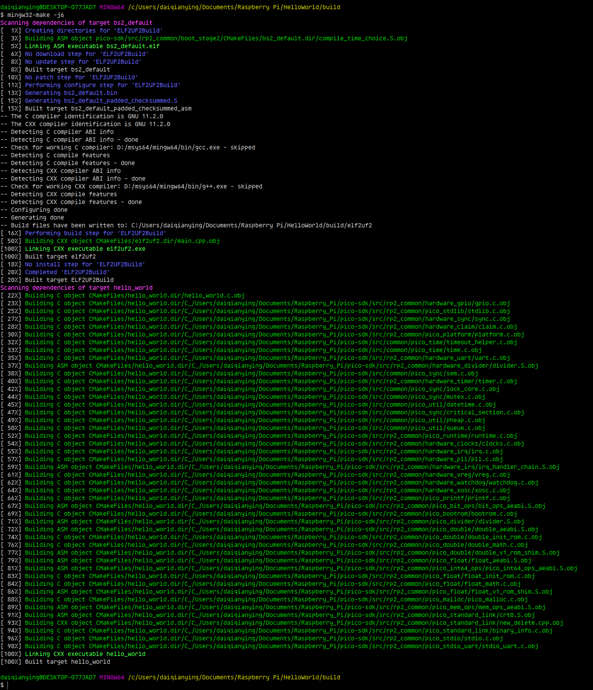

- [windows C++ 树莓派 pico 配置](#windows-c-树莓派-pico-配置)
  - [安装git for windows](#安装git-for-windows)
  - [安装python](#安装python)
  - [安装cmake](#安装cmake)
  - [下载Arm跨平台编译工具链](#下载arm跨平台编译工具链)
  - [安装msys2](#安装msys2)
    - [安装mingw-w64工具链](#安装mingw-w64工具链)
  - [安装vscode](#安装vscode)
    - [安装插件](#安装插件)
  - [工程环境配置](#工程环境配置)
    - [.vscode](#vscode)
    - [项目CMakeLists.txt](#项目cmakeliststxt)
  - [代码构建](#代码构建)

# windows C++ 树莓派 pico 配置

## 安装git for windows

## 安装python

## 安装cmake

## 下载Arm跨平台编译工具链

打开ARM公司网站 https://developer.arm.com/tools-and-software/open-source-software/developer-tools/gnu-toolchain/gnu-rm/downloads

下载并解压`gcc-arm-none-eabi-10.3-2021.10-win32.zip`

创建`gcc-arm-none-eabi.cmake`文件，拷贝如下内容

```cmake
# Call Cmake from the 'build' subfolder with the command below.
# For using Make:
# cmake -DCMAKE_MAKE_PROGRAM=make.exe -DCMAKE_TOOLCHAIN_FILE="arm-none-eabi-gcc.cmake" -G "Unix Makefiles" ..
# followed by
# 'make' or 'cmake --build .' to build it
#
# For using Ninja:
# cmake -DCMAKE_MAKE_PROGRAM=ninja.exe -DCMAKE_TOOLCHAIN_FILE="arm-none-eabi-gcc.cmake" -G "Ninja" ..
# followed by
# 'ninja' or 'cmake --build .' to build it

set(_THIS_MODULE_BASE_DIR "${CMAKE_CURRENT_LIST_DIR}")

set(CMAKE_SYSTEM_NAME Generic)
set(CMAKE_SYSTEM_PROCESSOR ARM)

set(ARM_TOOLCHAIN_DIR "${_THIS_MODULE_BASE_DIR}/bin")
set(BINUTILS_PATH ${ARM_TOOLCHAIN_DIR}) 

set(TOOLCHAIN_PREFIX ${ARM_TOOLCHAIN_DIR}/arm-none-eabi-)

set(CMAKE_TRY_COMPILE_TARGET_TYPE STATIC_LIBRARY)

set(CMAKE_C_COMPILER "${TOOLCHAIN_PREFIX}gcc.exe")
set(CMAKE_ASM_COMPILER ${CMAKE_C_COMPILER})
set(CMAKE_CXX_COMPILER "${TOOLCHAIN_PREFIX}g++.exe")

set(CMAKE_OBJCOPY ${TOOLCHAIN_PREFIX}objcopy CACHE INTERNAL "objcopy tool")
set(CMAKE_SIZE_UTIL ${TOOLCHAIN_PREFIX}size CACHE INTERNAL "size tool")

set(CMAKE_FIND_ROOT_PATH ${BINUTILS_PATH})
set(CMAKE_FIND_ROOT_PATH_MODE_PROGRAM NEVER)
set(CMAKE_FIND_ROOT_PATH_MODE_LIBRARY ONLY)
set(CMAKE_FIND_ROOT_PATH_MODE_INCLUDE ONLY)

set(CMAKE_C_FLAGS "${CMAKE_C_FLAGS} -mcpu=cortex-m0plus -mthumb")
foreach(LANG IN ITEMS C CXX ASM)
    set(CMAKE_${LANG}_FLAGS_INIT "${ARM_GCC_COMMON_FLAGS}")
    if (PICO_DEOPTIMIZED_DEBUG)
        set(CMAKE_${LANG}_FLAGS_DEBUG_INIT "-O0")
    else()
        set(CMAKE_${LANG}_FLAGS_DEBUG_INIT "-Og")
    endif()
    set(CMAKE_${LANG}_LINK_FLAGS "-Wl,--build-id=none")
endforeach()
```
将该文件放置到工具链根目录，目录结构如下
```
.
|-- arm-none-eabi
|-- bin
|-- gcc-arm-none-eabi.cmake
|-- lib
`-- share
```

## 安装msys2

### 安装mingw-w64工具链

```
pacman -S mingw-w64-x86_64-toolchain
where mingw32-make
```

## 安装vscode

### 安装插件

1. CMake Tools
2. Cmake
3. C/C++ Extension Pack

## 工程环境配置

### .vscode

1. cmake-kits.json

```
[
    {
        "name": "GCC Arm Embedded",
        // 修改实际路径
        "toolchainFile": "${workspaceRoot}/../gcc-arm-none-eabi-10.3-2021.10/gcc-arm-none-eabi.cmake"
    }
]
```

2. settings.json

```
{
    // These settings tweaks to the cmake plugin will ensure
    // that you debug using cortex-debug instead of trying to launch
    // a Pico binary on the host
    "cmake.statusbar.advanced": {
        "debug": {
            "visibility": "hidden"
        },
        "launch": {
            "visibility": "hidden"
        },
        "build": {
            "visibility": "hidden"
        },
        "buildTarget": {
            "visibility": "hidden"
        }
    },
    "cmake.buildBeforeRun": true,
    "C_Cpp.default.configurationProvider": "ms-vscode.cmake-tools",
    
    // 修改PICO_SDK_PATH实际路径
    "cmake.configureEnvironment": {
        "PICO_SDK_PATH": "${workspaceRoot}/../pico-sdk"
    },
    "cmake.buildEnvironment": {
        "PICO_SDK_PATH": "${workspaceRoot}/../pico-sdk"
    },
    "cmake.environment": {
        "PICO_SDK_PATH": "${workspaceRoot}/../pico-sdk"
    },
    
    "cmake.generator": "MinGW Makefiles",
    "cmake.configureSettings": {
        // 修改实际路径
        "CMAKE_MAKE_PROGRAM": "D:\\msys64\\mingw64\\bin\\mingw32-make.exe"
    },
    "files.associations": {
        "stdlib.h": "c"
    }
}
```

### 项目CMakeLists.txt

```
cmake_minimum_required(VERSION 3.13)

# initialize the SDK based on PICO_SDK_PATH
# note: this must happen before project()
include(pico_sdk_import.cmake)

project(hello_world C CXX ASM)
set(CMAKE_C_STANDARD 11)
set(CMAKE_CXX_STANDARD 17)

if (PICO_SDK_VERSION_STRING VERSION_LESS "1.3.0")
    message(FATAL_ERROR "Raspberry Pi Pico SDK version 1.3.0 (or later) required. Your version is ${PICO_SDK_VERSION_STRING}")
endif()

# initialize the Raspberry Pi Pico SDK
pico_sdk_init()

# rest of your project
add_executable(hello_world
    hello_world.c
)

# Add pico_stdlib library which aggregates commonly used features
target_link_libraries(hello_world pico_stdlib)

# create map/bin/hex/uf2 file in addition to ELF.
pico_add_extra_outputs(hello_world)
```

## 代码构建
1. 选择工具链



2. 打开mingw64终端



3. 进入build目录
4. mingw64-make -j4



